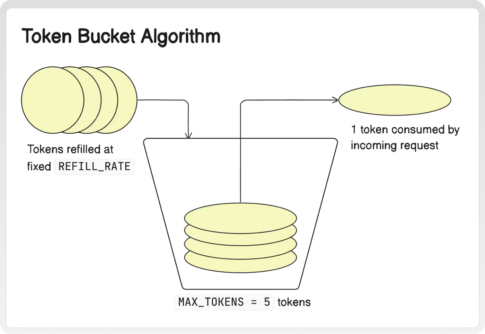

# 🔒 Rate Limiting Algorithms in JavaScript

This project contains JavaScript implementations of five widely used rate limiting algorithms. These are crucial for managing traffic to APIs and ensuring fair use.

---

## 🪙 Token Bucket Algorithm

A fixed-size bucket holds tokens. Each request consumes one token. Tokens are refilled periodically.



- Allows short bursts
- Ideal when occasional spikes are okay

---

## 🚰 Leaky Bucket Algorithm

Incoming requests enter a bucket. Requests are processed (leaked) at a constant rate. If full, requests are dropped.


- Smoothens traffic spikes
- Enforces steady flow rate

---

## 🪵 Fixed Window Counter

Counts the number of requests in a fixed window (e.g. per minute). If the count exceeds a limit, requests are rejected.

- Simple but can allow bursts at boundary

---

## 📜 Sliding Window Logs

Logs timestamps of each request and counts how many happened in the last fixed window.

- More accurate than fixed window
- Memory intensive

---

## 🧮 Sliding Window Counter

Uses smaller sub-windows to estimate request count in the full window.

- Memory efficient
- Great for distributed rate limiters (e.g. Redis)

---

## 📁 How to Run

```bash
node tokenBucket.js
node leakyBucket.js
node fixedWindowCounter.js
node slidingWindowLogs.js
node slidingWindowCounter.js
